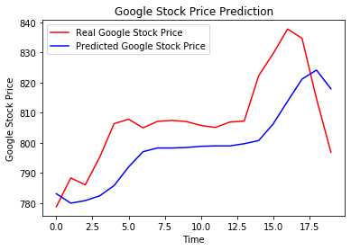

# Google-Stock-Price-Trend-Prediction-in-Python
Predicting the upward and downward trend of the Google Stock Price using LSTM Recurring Neural Network.

* Trained a LSTM Model on five years(from 2012 to 2016) data of Google Stock Price and predict the Google stock price
* Used LSTM RNN algorithm with model accuracy of 90%
